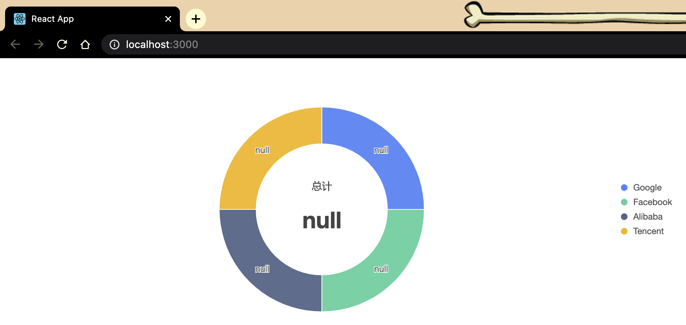

# Donut implement by @ant-design/charts

use [@ant-design/charts](https://www.npmjs.com/package/@ant-design/charts) which is based on [@antv/g2plot](https://www.npmjs.com/package/@antv/g2plot)

## Run

```bash
$ npm install
$ npm start
```

## npm module version

```bash
$ npm info @ant-design/charts version
0.9.6
$ npm info @antv/g2plot version
1.1.8
```

## BUG

value is null



